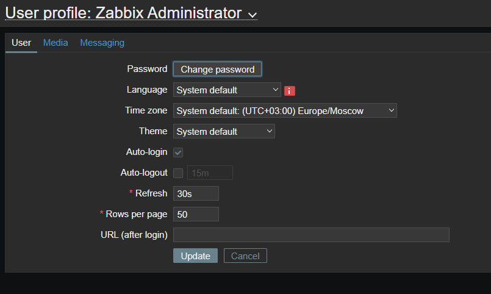
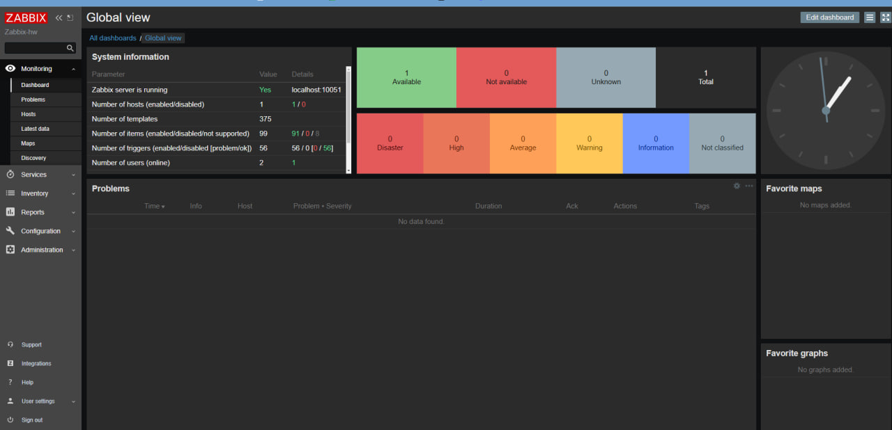
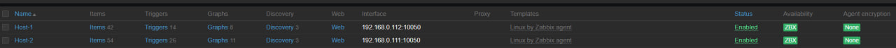
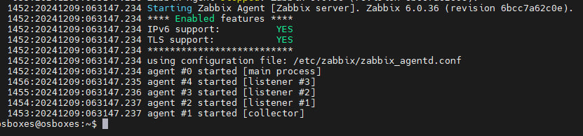

# Домашнее задание к занятию «Система мониторинга Zabbix» Макану А.В.

### Задание 1





```bash
wget https://repo.zabbix.com/zabbix/6.0/debian/pool/main/z/zabbix-release/zabbix-release_latest_6.0+debian11_all.deb
dpkg -i zabbix-release_latest_6.0+debian11_all.deb
apt update
apt install zabbix-server-pgsql zabbix-frontend-php php7.4-pgsql zabbix-apache-conf zabbix-sql-scripts zabbix-agent
apt install postgresql
sudo -u postgres createuser --pwprompt zabbix
sudo -u postgres createdb -O zabbix zabbix
zcat /usr/share/zabbix-sql-scripts/postgresql/server.sql.gz | sudo -u zabbix psql zabbix
DBPassword=password
systemctl restart zabbix-server zabbix-agent apache2
systemctl enable zabb
```

### Задание 2



```bash
wget https://repo.zabbix.com/zabbix/6.0/debian/pool/main/z/zabbix-release/
zabbix-release_6.0-4%2Bdebian11_all.deb
dpkg -i zabbix-release_6.0-4+debian11_all.deb
apt update
sudo apt install zabbix-agent -y
sudo systemctl restart zabbix-agent
cat /var/log/zabbix/zabbix_agentd.log
sudo nano /etc/zabbix/zabbix_agentd.conf
sudo systemctl restart zabbix-agent
```
